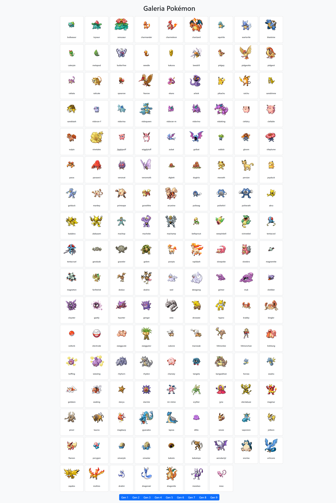

# Modulo 6 - Grupal 5
# Grupo 3
# Galeria Pokemon

### Problemática:

La organización local necesita acceder a un conjunto de datos que incluya tanto el nombre como la imagen de los primeros 150 pokémones de la PokeAPI. Actualmente, no cuentan con un endpoint unificado para obtener estos datos directamente desde la API.

Se debe desarrollar un servidor con **Node.js** y **Express** que disponga de una ruta para obtener esta información procesada en un formato JSON. Además, el servidor debe servir una página HTML que consuma este JSON y visualice la información de los pokémones en una galería.

### Consideraciones generales

1. Utilizar la PokeAPI para obtener los datos de los pokémones.
2. Usar las herramientas asincrónicas de JavaScript (`async/await` y `Promise.all()`).
3. Crear una ruta en el servidor (`/pokemones`) que devuelva un JSON con los nombres e imágenes de los 150 primeros pokémones.
4. Servir una página HTML estática que visualice esta información.
5. Utilizar **Nodemon** para facilitar el desarrollo.

### Requisitos:

- Node.js
- Express
- Axios
- Nodemon (opcional)
- PokeAPI (https://pokeapi.co/)

### Requerimientos del ejercicio:

- Crea un nuevo archivo llamado `app.js` y configura Express para levantar el servidor.
- Implementa una ruta `/pokemones` que devuelva un JSON con los nombres e imágenes de los pokémones.
- Crea un archivo HTML en la carpeta **public** para mostrar la galería de pokémones.
- Utiliza `async/await` para obtener la lista de pokémones desde la PokeAPI.
- Usa `Promise.all()` para manejar las peticiones asíncronas de los detalles de cada pokémon.
- Sirve los archivos estáticos con Express desde la carpeta **public**.
- Captura las ventanas mostrando la galería y el JSON de los pokémones obtenidos.

## Evidencias

1. Galeria funcionando en `/pokemones`

